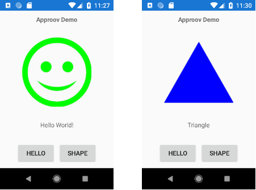

# Xamarin Approov Demo

This project demonstrates a Xamarin client with Approov integration.


The client app has `HELLO` and `SHAPE` buutons. When the `HELLO` button is pressed,
a smiley face is displayed if the HTTPS connection to the Approov demo server is successful.



If the client app has been properly registered with the Approov service, when the
`SHAPE` button is pressed, a random shape will be displayed.

The demo currently runs on Android. The iOS version is on its way.

# Prerequisites

You will need to download the Approov Demo package at [approov.io](https://approov.io). 
See the demo download README.md file for more information.

***NOTE**: because of GDPR, the demo download server is temporarily disabled, contact [support@criticalblue.com](mailto:support@criticalblue.com) for help.*

This demo uses the download demo's backend server, the Android and iOS Approov libraries, 
and the Approov registration tools.

# The Demo Back-end Server

The Shapes demo server is very simple, you can access it at https://demo-server.approovr.io/.
It has 2 endpoints:

* A Hello endpoint (https://demo-server.approovr.io/hello) that returns 'Hello, World!'
* A Shapes endpoint (https://demo-server.approovr.io/shapes) that returns a random shape

The Hello endpoint has no security (except https) so you should be able to
access it using your software of choice. For the purposes of our examples we
will just use curl.

```
$ curl -D- https://demo-server.approovr.io/hello
HTTP/1.0 200 OK
Content-Type: text/html; charset=utf-8
Content-Length: 12
Server: Werkzeug/0.11.15 Python/3.4.3
Date: Tue, 31 Jan 2017 23:38:52 GMT

Hello World!
```

The Shape endpoint is set up to expect an Approov token. If you try to access
it using curl without the correct header, or with a header that contains an
invalid token, you will get a 400 response.

```
$ curl -D- https://demo-server.approovr.io/shapes
HTTP/1.0 400 BAD REQUEST
Content-Type: text/html
Content-Length: 192
Server: Werkzeug/0.11.15 Python/3.4.3
Date: Tue, 31 Jan 2017 23:43:40 GMT

<!DOCTYPE HTML PUBLIC "-//W3C//DTD HTML 3.2 Final//EN">
<title>400 Bad Request</title>
<h1>Bad Request</h1>
<p>The browser (or proxy) sent a request that this server could not
understand.</p>
```

# Xamarin Solution Overview

The Xamarin Demo solution contains multiple projects:

- XamarinApproovDemo
- XamarinApproovDemo.Android
- XamarinApproovDemo.iOS
- XamarinApproov
- XamarinApproov.Android
- XamarinApproov.iOS
- Approov.Android
- Approov.iOS

The sample `XamarinApproovDemo` app is built from the `XamarinApproovDemo` directories.

All calls to attest the app and fetch an Approov token are made in the platform-independent `XamariApproovDemo` project.

The corresponding platform-specific `XamariApproovDemo.Android` and `XamariApproovDemo.iOS` projects require a small addition to initialize the appropriate Approov library when the app starts.

The Approov API is exposed to the `XamariApproovDemo` project through the platform-independent `XamarinApprnoov` project. 
The corresponding platform-specific Android and iOS projects are only called by the appropriate platform-specific app projects during initialization.

The platform-specific `Approov.Android` and `Approov.iOS` projects bind to the native Android and iOS Approov libraries.
These libraries are different for each customer, so they are not included in the sample repo. Directions for binding Approov
libraries are included below.

# Xamarin Platform-Independent Approov API

The `XamarinApproov` project contains the platform-independent Approov API.

## Approover

The `Approover` class contains two API calls to attest and fetch an Approov token, synchronous and asynchronous.

The synchronous `Approover.fetchApproovToken(string uri)` method blocks until a token is fetched. 

The method returns an Approov token as a string. A returned string equal to `Approover.TOKEN_FAILURE` indicates failure to receive a token from the Approov attestation service.

The `uri` should contain the domain targeted by the proetcted API endpoint to add dynamic man-in-the-middle protection. If `null`, no dynamic protection is used. See the [Approov docs](https://approov.io/docs/) for more information. Synchronous calls should not be used on the main UI thread.

The asynchronous `Approover.fetchApproovTokenAsync(string uri)` method is run as a separate `Task`. The method returns a `Task<string>` object, and the token string can be read from the task when the task completes. A typical usage is:

```
    // fetch approov token
    string token = await Approover.Shared.fetchTokenAsync(null);

    // check token fetch success
    if (token == Approover.TOKEN_FAILURE)
    {
        // take corrective action or continue and
        // send token to backend to notify service of failure
    }

    // add approov token header to request
    request.Headers.Add(APPROOV_HEADER, token);

    ...
```

## ApproovInterceptor

The `ApproovInterceptor` class is included as an example of a `DelegatingHandler` for an `HttpClient`. The sample intercepts client request calls, fetches an Approov token, and adds it to the request's headers. A typical usage is:

```
    private const string shapeUrl = "https://demo-server.approovr.io/shapes";

    private readonly HttpClient shapeClient = new HttpClient(new ApproovInterceptor(null));
 
    private async void OnShape(object sender, EventArgs e)
    {
        // an Approov token is automatically added to GET headers
        var response = await shapeClient.GetAsync(shapeUrl);

        if (response.IsSuccessStatusCode) ...
```

This technique is very useful to ensure that all calls made by an http client are automatically protected by Approov.

# Xamarin Platform-Specific Initialization

The platform-specific `XamarinApproov` library must be initialized before any platform-independent API calls are made.

## Android Initialization

For Android, the Approov library is initialized by adding to the `Application` object. In the Android app project, `XamarinApproov.Demo.Android` in the demo example, create an `Application` class and its `OnCreate()` method as necessary.
Create and assign an `AndroidApproover` object to the `Shared` singleton in the platform-independent `Approover` class:

```
    public override void OnCreate()
    {
        base.OnCreate();

        // Set up shared Android Approover
        Approover.Shared = new AndroidApproover(this.ApplicationContext);
    }
```

## iOS Initialization

*TBD*

# Approov Library Xamarin Binding

Native Approov libraries are provided for Android and iOS platforms. Libraries are unique for each customer and the downloadable demo, so each library needs to be bound to the Xamarin environment.

## Android Binding

Approov Android libraries are provided as `.aar` files. Instructions for binding `.aar` libraries are described in [Xamarin docs](https://docs.microsoft.com/en-us/xamarin/android/platform/binding-java-library/binding-an-aar).

The general steps are:

- Create a new Java Bindings Library project.
- Add a single .AAR file to the project. A binding project may only contain a single .AAR.
- Set the appropriate build action for the .AAR file.
- Choose a target framework that the .AAR supports.
- Build the Bindings Library.

The first time you build the library there will be many warnings and one error. Correct the error by ignoring the problematic `finalize()` method binding in the `Transform.Metadata.xml` file:

```
<?xml version="1.0" encoding="UTF-8"?>
<metadata>

    <remove-node path="/api/package[@name='com.criticalblue.attestationlibrary']/class[@name='CA3AttestationInternal']/method[@name='finalize']" />

</metadata>
```

This library project needs to be referenced by the `XamarinApproov.Android` project to complete the itegration.

## iOS Binding

*TBD*

# Xamarin App Registration

After building the Xamarin Android and iOS apps, the apps must be registered with the Approov service to enable the apps to be properly attested.

Registration tools are provided as part of the demo download or the registration tools download from your customer portal.
The registration token used to authenticate the registration is provided separately.

Registration tools are provided for Android and iOS on Windows, Mac, and Linux development platforms.

## Android Registration

Run a regsitration by changing into the appropriate platform directory and executing the registration command, specifying the registration token, Android `APK` file, and an expiration time. For example:

```
$ cd your/registration-tools/Android/Mac
$ ./registration
    -t your/registration_access.tok \
    -a your/xamarin/solution/XamarinApproovDemo/bin/ Debug/com.criticalblue.XamarinApproovDemo-Signed.apk\
    -e 2h
```

The `-e` flag determines how long until the registration expires. For non-production apps, a two hours `2h` or one day `1d` are typical registration lifetimes.

## iOS Registration

*TBD*

# App Operation

After a short propagation delay, your registered app should begin properly attesting within five minutes. Reinstalling the app may start properly attesting sooner.

Install your Android and iOS apps and run the apps to verify successful operation.

**NOTE**: Customer settings may change which platforms environments will attest successfully. In general:

- Android apps will typically run successfully on either emulator or physical device.
- iOS apps will *never* attest successfully on the iOS simulator.
- Neither Android nor iOS apps will attest succesfully when run in a debugger.

# Non-Production Example

This is a simple example for illustrative purposes, and it is not intended for production.
